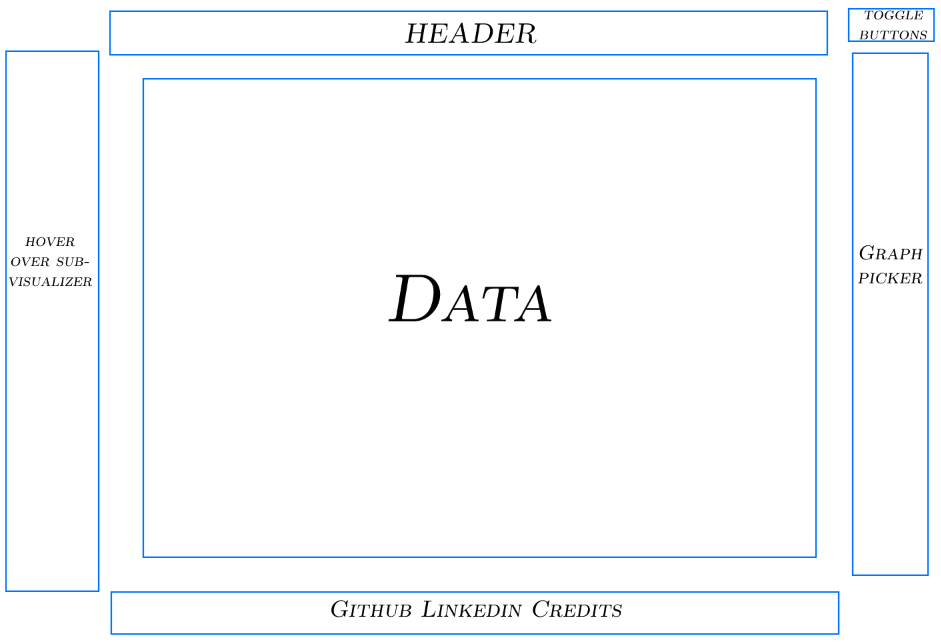
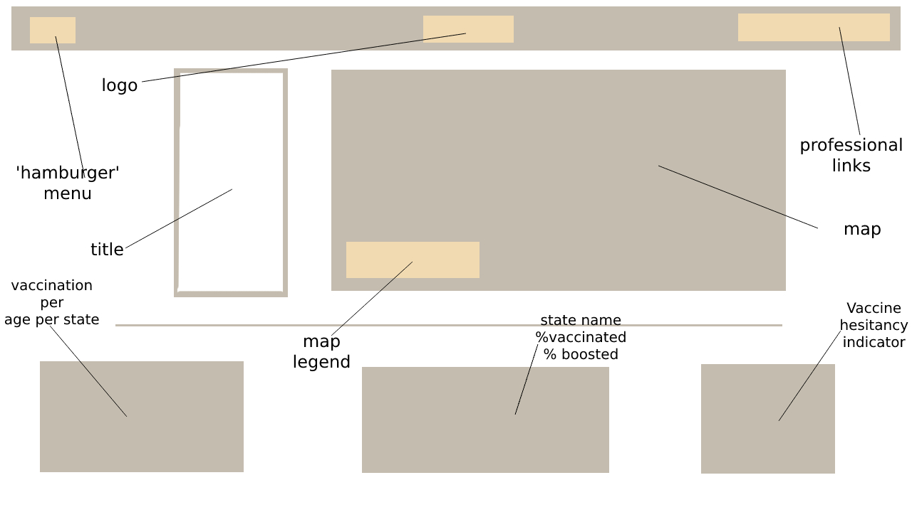

Background
---
---
The name of this project and tool is 052. 052 was built to create a visually-appealing interface that provides users with the most recent data on vaccine progression (via state) through the US. I especially would like to track vaccine rates and booster rates when compared across the country. The goal for the project is to choose an API that is regularly updated and robust enough to depict a good snapshot of contemporary COVID vaccination efforts. The tool will be designed to be responsive, user-friendly, visually appealing, and completely dynamic - connecting to strong, thorough, and present-day data. If there is enough interesting data, I would like to show multiple snapshots of COVID Vaccination - answering a question akin to 'How many people in a state are COVID vaccination hesitant?' As the data is initially sourced and parsed by the CDC, an arm of the US government, all data here lies within the public domain.

Functionality and MVP's
---
---

In COVID_Data_Visualizer, users will be able to:

1) Access continuously updated data on vaccine rates, booster rates, and other relevant topics via several API's available via Data.CDC.gov
2) Interact with graphs, charts other data visuals with a variety of :hover and :active events.
3) See a variety of stylized representations of data.
4) Interact with a flat, minimalist design page - learning about several comparable parameters that measure a state's COVID vaccination effort and it's peoples' responses to said effort.
5) Connect directly to the databases and sources through links available on a 'hamburger' menu.

In addition, this project will include:

1) An introductory modal briefly describing the project, simple instructions for use of the visualizer, and links by which users can professionally connect with me.
2) A production README.

Wireframe(s)
---
---
1) Initial Blueprint Mockup:

2) Production Wireframe:

Technologies, Libraries, and API's
---
---

1) D3.js
2) Charts.js
3) Data.CDC.gov
4) Google Fonts API

Implementation Timeline
---
---

1) Friday Afternoon - D3.js tutorials, troubleshooting API usage, and searching CDC WONDER for interesting data that I want to visualize.

2) Weekend - Start on making flagship graph, look for data for a secondary and tertiary graph. Continue learning about D3. Research how to make a modal. If permitted to use Anime.js, look into how to animate subsections. Research flat, minimalist design.

3) Monday - Polish flagship graph, further knowledge of D3, try to make flagship graph look good with data populated from API - try to render this feature to browser. Start on left-div hover sub-visualizer - based on datasets see what kind of info I would want to show up.

4) Tuesday - Polish LinkedIn a little bit (this is part of my project because I want the footer to actually lead people to information about me. GET A REAL LINKEDIN PICTURE.) Finish secondary and tertiary charts, render them. Work on secondary features and interactive elements.

5) Wednesday - Interactive elements and secondary features day. Look into dark mode/light mode. Birds eye positioning of elements.Finishing touches!

6) Thursday - Update README and possibly more finishing touches if time permits.

Bonus Features
---
---

1) Menu with a variety of add-ons including but not limited to: a last updated date that pulls directly from the CDC database, patch notes, and a small homage to those who have helped us along the way.
2) Modal for landing page.
3) Vaccine hesitation rating per state.

Interactions
---
---

1) 

To Do
---
---

1) Troubleshoot Google Fonts API