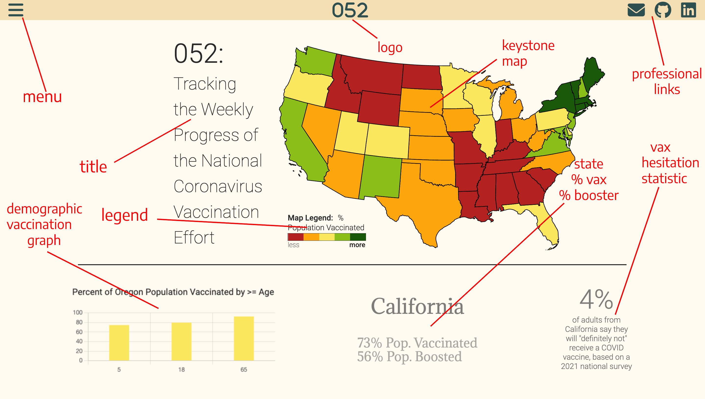

# 052 - Covid Vaccination Data Visualizer

A tool built to increase visbility to and readability of the latest COVID Vaccination data.

Live Link: https://jayreddy040-510.github.io/Covid_Data_Visualizer/

Table of Contents
---
---

1) Background

2) Functionality and MVP's

3) Screenshots and Video Demonstrations

4) Technologies, Libraries, and API's

Background
---
---
The name of this project and tool is 052. 052 was built to create a visually-appealing interface that provides users with the most recent data on vaccine progression (via state) through the US. I especially would like to track vaccine rates and booster rates when compared across the country. The goal for the project is to choose an API (or several API's with data that can be amalgamated) that is regularly updated and robust enough to depict a good snapshot of contemporary COVID vaccination efforts. The tool will be designed to be responsive, user-friendly, visually appealing, and completely dynamic - connecting to strong, thorough, and present-day data.

 If there is enough interesting data, I would like to show multiple snapshots of COVID Vaccination - answering questions that are beyond number of residents of a state being vaccinated. As the data is initially sourced and parsed by the CDC, an arm of the US government, all data here lies within the public domain.

Functionality and MVP's
---
---

In COVID_Data_Visualizer, users will be able to:

1) Access continuously updated data on vaccine rates, booster rates, and other relevant topics via several API's available via Data.CDC.gov
2) Interact with graphs, charts other data visuals with a variety of :hover and :active events.
3) See a variety of stylized representations of data.
4) Interact with a flat, minimalist design page - learning about several comparable parameters that measure a state's COVID vaccination effort and it's peoples' responses to said effort.
5) Connect directly to the databases and sources through links available on a 'hamburger' menu.

In addition, this project will include:

1) An introductory modal briefly describing the project, simple instructions for use of the visualizer, and links by which users can professionally connect with me.
2) A production README.

Screenshots and Video Demonstrations
---
---
1) 052 has many features and data that a user can interpret through interacting with the tool. 

Technologies, Libraries, and API's
---
---

1) D3.js
2) Charts.js
3) Data.CDC.gov
4) Google Fonts API

